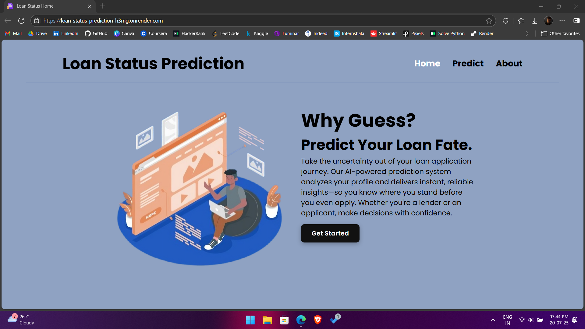
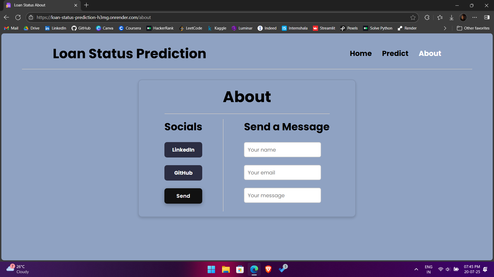
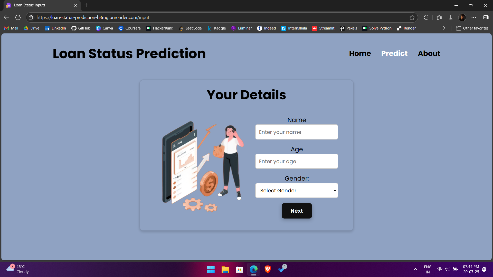
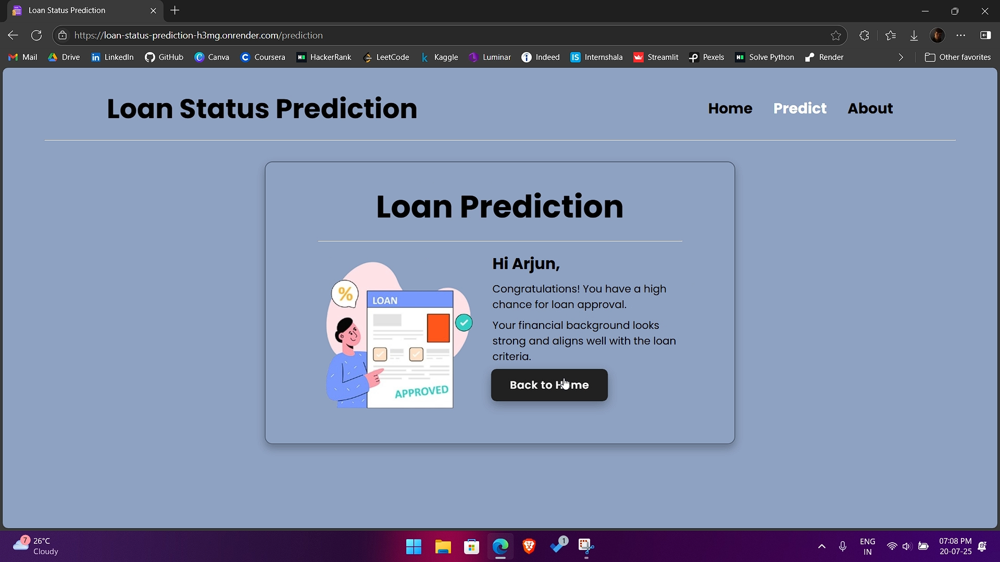
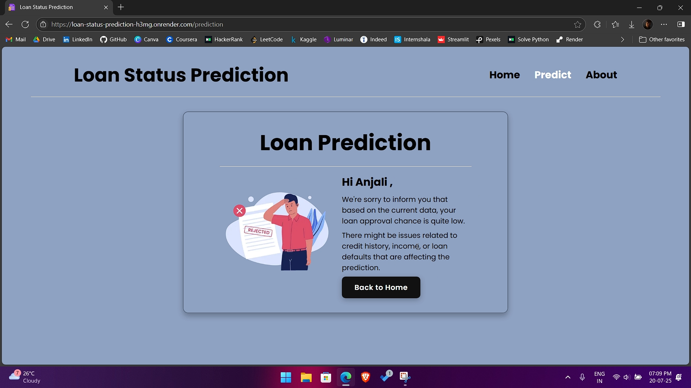

# 🏦 Loan Status Prediction App

A sleek and intuitive **Flask** web application that predicts your loan approval chances using machine learning. From raw data to deployment, every step — including **EDA**, **preprocessing**, **model selection**, **hyperparameter tuning**, **cross-validation**, and **real-world testing** — is integrated to deliver powerful insights in real-time.

---

## 🌐 Live App

🔗 [Try the app now](https://loan-status-prediction-h3mg.onrender.com)

---

## ⚡ Key Features

- 📊 Analyze borrower details to predict loan approval
- 🤖 Powered by Gradient Boosting Classifier (best performer after model comparison)
- 🔄 Robust pipeline with preprocessing, EDA, and ensemble techniques
- 🔬 Fine-tuned using RandomizedSearchCV for best hyperparameters
- 📈 Achieved a cross-validation score of **95%**
- 🧪 Tested with real data for practical reliability
- 🌐 Deployed using **Flask** and hosted on **Render**
- 💻 Clean, modern UI with a focus on user experience

---

## 🌟 Why Guess?

**Predict Your Loan Fate.**  
Take the uncertainty out of your loan application journey. Our AI-powered prediction system analyzes your profile and delivers instant, reliable insights—so you know where you stand before you even apply.  
Whether you're a lender or an applicant, make decisions with confidence.

---

## 🛠️ Tech Stack

| Tool     | Purpose                  |
| -------- | ------------------------ |
| Flask    | Web framework for Python |
| Pandas   | Data manipulation        |
| Sk-learn | ML algorithms and tuning |
| HTML/CSS | Frontend design          |
| Render   | Deployment platform      |

---

## 🖼️ Screenshots

  
  
  
  

---

## 👨‍💻 Author

**Vaisakh Nirupam**  
🔗 [LinkedIn](https://www.linkedin.com/in/vaisakh-nirupam)

---
